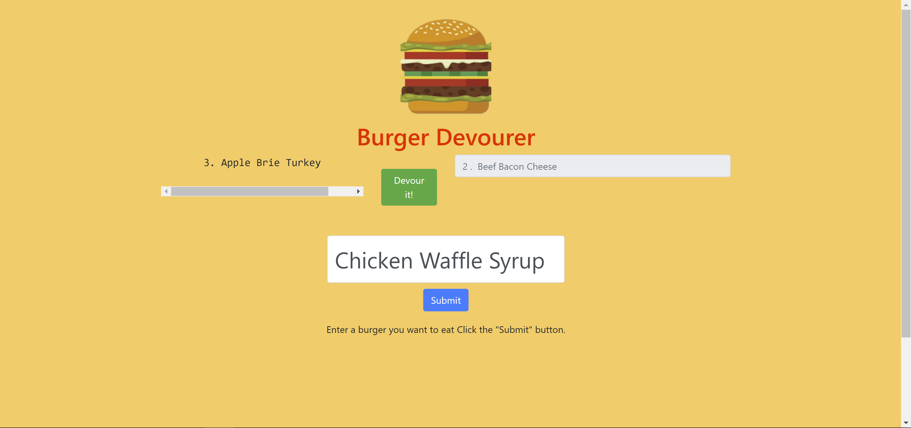

# Project Name: Burger

## Description

Express and Handlebars app that allows a user to enter and virtually devour a burger, utlizing an MVC framework, express, express handlebars, mySQL, Javascript, NodeJS, and deployed on Heroku.

## Table of Contents

1. [Installation](#installation)

2. [Usage](#usage)

3. [License](#license)

4. [Languages](#languages)

5. [Screenshots](#screenshots)

## Installation

None required for usage. For development, see languages used for required npm packages.

## Usage

none

## License

none

## Languages

`Javascript, CSS, npm packages utilized during development: NodeJS, Express, Express Handlebars, MySQL, `

## Screenshots

deployed app: https://rocky-anchorage-70654.herokuapp.com/

GitHub Repository:

This repo: https://github.com/SamFan808/burger
